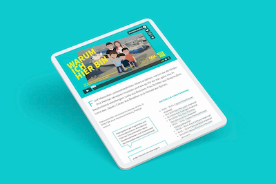
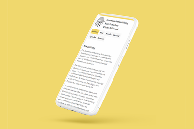

# Frontend Dev Portfolio

## Warum ich hier bin

| Performance | Accessibility | Best Practices | LCP | TBT   | CLS |
| ----------- | ------------- | -------------- | --- | ----- | --- |
| 94          | 94            | 93             | 1.8s  | 170ms | 0   |

- Stack: Wordpress Theme
- URL: https://warumichhierbin.de
- Repo: https://github.com/fgeierst/warumichhierbin
- Design sketches: https://www.figma.com/file/p893OZUMylGjeD79N1i4SF

## Gemeinschaftsstiftung Bolivianisches Kinderhilfswerk

| Performance | Accessibility | Best Practices | LCP  | TBT | CLS   |
| ----------- | ------------- | -------------- | ---- | --- | ----- |
| 100         | 100            | 100            | 1.5s | 0ms | 0 |

- Stack: [Eleventy](https://www.11ty.dev/)
- URL: https://www.bolivianisches-kinderhilfswerk-stiftung.de
- Repo: https://github.com/fgeierst/bolivianisches-kinderhilfswerk-stiftung
- Design sketch: https://www.figma.com/file/KBZmmzAYpd8QEq0Rt49KSh

## Codepens

- [`` sizes & srcset Explainer](https://codepen.io/fgeierst/pen/yLaPwWW)
- [Visualize responsive font-size calculation with `clamp()`](https://codepen.io/fgeierst/pen/zYvNdWR)
- [CSS Speech Bubble Component (using SVG Data URI)](https://codepen.io/fgeierst/pen/eYpzXBg)
- [CSS `object-fit`: cover vs. contain Explainer](https://codepen.io/fgeierst/pen/yLYaJxg)
